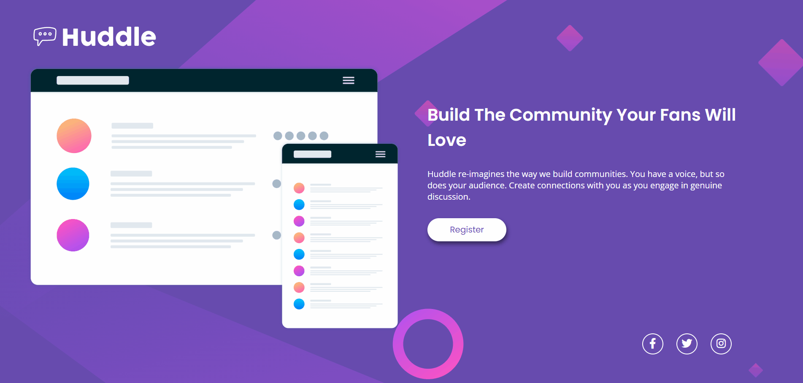
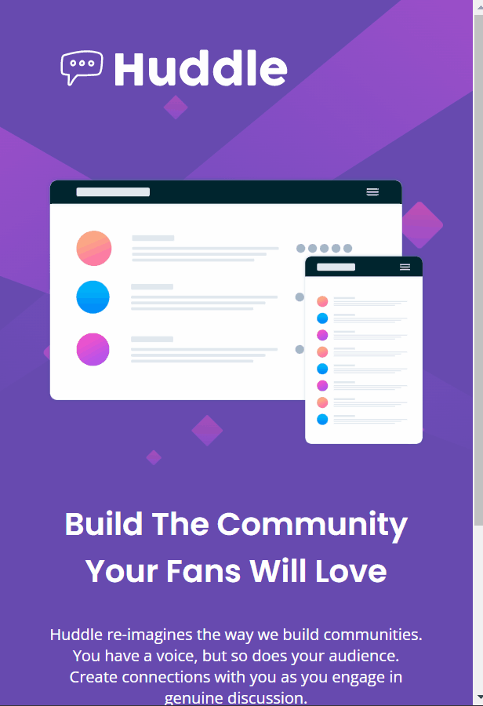

# Quest HTML + CSS - DevQuest
Este é um projeto para fins didáticos, proposto no curso <a href="https://www.instagram.com/devemdobro/" target="_blank">DevQuest</a>, disponível também no site frontendmentor.io.  

O projeto consiste em clonar a landing page de uma empresa fictícia, utilizando somente HTML e CSS. Além disso, foi necessário fazer a versão responsiva do site.

## Tecnologias utilizadas:
- HTML
- CSS
  
## Versão Desktop:

  

## Versão Mobile:
